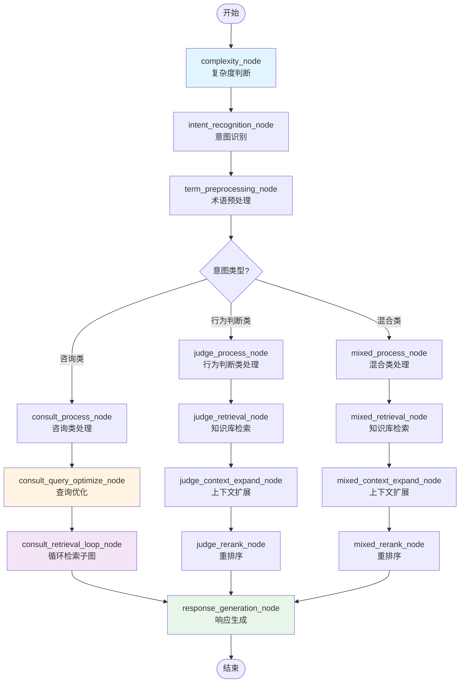
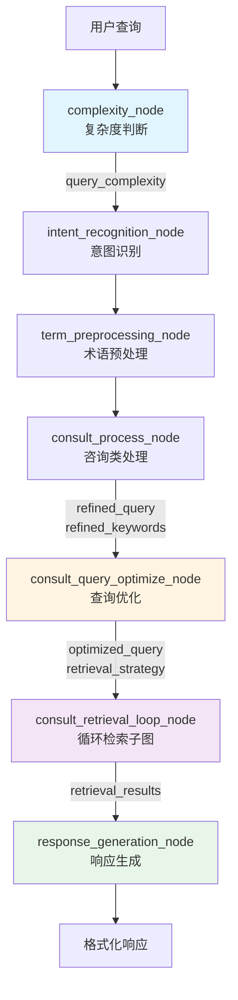
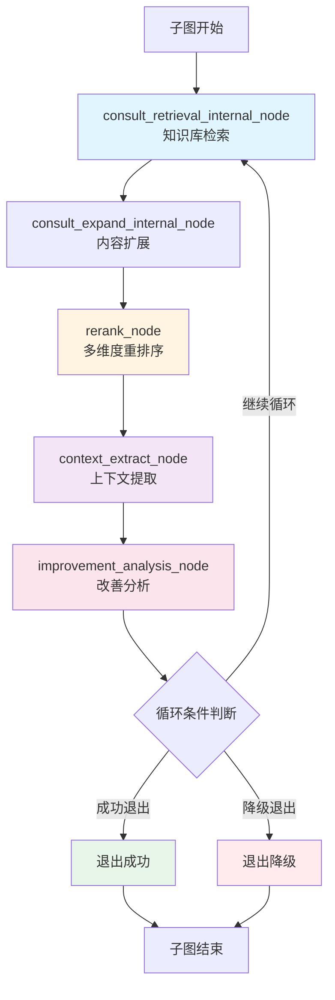

# 学术诚信助手 (Academic Integrity Assistant)

> 基于 LangGraph 的智能学术诚信问答系统，支持三类意图识别、自适应检索策略和多轮循环优化

---

## 📖 项目简介

学术诚信助手是一个基于 LangGraph 框架开发的工作流问答系统，专门用于回答学术道德、学术规范、学术不端行为等相关问题。系统通过意图识别、术语预处理、复杂度判断、动态检索和循环优化等技术，为用户提供准确、可信、可验证的答案。

### 核心价值

- **智能意图识别**：自动识别用户问题的类型（咨询类/行为判断类/混合类）
- **自适应检索**：根据查询复杂度动态调整检索策略
- **循环优化**：通过多轮检索和 LLM 增强持续提升答案质量
- **可信度保障**：每个观点标注来源，提供可验证方式

---

## ✨ 功能特性

### 意图识别与分类

- **咨询类**：询问定义、规范、要求等知识性问题
  - 例如："什么是学术不端行为？"
  - 例如："论文引用有哪些规范要求？"

- **行为判断类**：判断特定行为是否合规
  - 例如："我能否在论文中重复使用自己已发表的内容？"
  - 例如："引用网络资料时需要注意什么？"

- **混合类**：既包含咨询也包含行为判断
  - 例如："自我抄袭的定义是什么，我之前发表的内容可以引用吗？"

### 查询复杂度判断

- **Simple（简单）**：单一概念、明确的问题
  - 策略：聚焦核心，减少噪音，快速检索
  - 参数：top_k=10, min_score=0.4, max_rounds=1

- **Standard（标准）**：中等复杂度，需要综合分析
  - 策略：平衡准确性和全面性
  - 参数：top_k=15, min_score=0.3, max_rounds=2

- **Complex（复杂）**：多概念关联、需要深入分析
  - 策略：扩展范围，保留更多信息，多轮优化
  - 参数：top_k=20, min_score=0.25, max_rounds=3

### 动态检索策略

根据查询复杂度和优化节点输出的检索策略，动态调整：
- 每轮的检索数量（top_k）
- 最小相关性阈值（min_score）
- 最大检索轮次（max_rounds）
- 提前退出条件

### 术语预处理与语义增强

- **术语标准化**：识别非标准术语并映射到标准术语
- **术语扩展**：基于领域知识扩展相关术语
- **要素提取**：提取行为要素、对象要素
- **语义增强**：构建语义增强查询

### 循环检索与智能优化

- **多轮检索**：最多3轮循环，逐步提升检索质量
- **内容扩展**：扩展检索结果到完整段落（500-800字）
- **多维度重排序**：相关性、权威性、完整性、时效性加权评分
- **上下文提取**：提取关键概念、关系图谱、缺失方面、总结
- **改善分析**：LLM 预测下一轮的改善潜力，指导循环决策
- **智能退出**：基于分数阈值、轮次限制、收敛检测决定退出时机

### 自然对话风格响应

- 去除系统内部信息（意图类型、咨询问题标题等）
- 采用专业顾问的对话语气
- 每个观点标注信息来源
- 提供可验证的参考文献或来源

---

## 🎯 项目亮点

### 1. 基于复杂度的自适应检索

首次在学术问答系统中引入查询复杂度判断，根据问题复杂度动态调整检索策略，避免简单问题过度检索，复杂问题检索不足。

### 2. LLM 增强的循环优化

不仅依赖传统的检索分数优化，还引入 LLM 进行改善分析，预测下一轮的检索潜力，实现智能化循环决策。

### 3. 多维度评分体系

重排序采用加权评分模型（相关性40%、权威性30%、完整性20%、时效性10%），确保返回结果的质量和可信度。

### 4. 模块化架构设计

- 单一职责原则：每个节点只负责一个功能
- 高内聚低耦合：节点之间通过状态对象传递数据
- 配置驱动：所有提示词和参数通过 JSON 配置文件管理

### 5. 子图化循环实现

将复杂的循环逻辑封装为子图（`loop_graph.py`），主图保持 DAG 结构，易于理解和维护。

---

## 🏗️ 技术架构

### 技术栈

- **工作流框架**：LangGraph 1.0
- **大语言模型**：豆包 Seed (doubao-seed-1-8-251228)
- **知识库**：向量检索服务
- **语言**：Python 3.8+
- **状态管理**：Pydantic BaseModel
- **模板引擎**：Jinja2

### 目录结构

```
├── config/                    # 配置文件目录
│   ├── loop/                  # 循环检索配置
│   │   └── consult_loop_config.json
│   └── nodes/                 # 节点配置
│       ├── complexity_cfg.json
│       └── consult/           # 咨询类节点配置
│           ├── consult_context_extract_cfg.json
│           ├── consult_improvement_analysis_cfg.json
│           ├── consult_query_optimize_cfg.json
│           └── consult_rerank_cfg.json
├── docs/                      # 文档目录
│   └── 流程图.md
├── src/                       # 源代码目录
│   ├── agents/                # Agent代码
│   ├── graphs/                # 工作流编排
│   │   ├── nodes/             # 节点实现
│   │   │   ├── common.py      # 通用节点
│   │   │   ├── consult.py     # 咨询类节点
│   │   │   ├── consult_loop.py# 咨询类循环检索节点（调用子图）
│   │   │   ├── judge.py       # 行为判断类节点
│   │   │   └── mixed.py       # 混合类节点
│   │   ├── graph.py           # 主图编排
│   │   ├── loop_graph.py      # 循环检索子图
│   │   ├── state.py           # 状态定义
│   │   └── loop_config_loader.py # 配置加载器
│   ├── storage/               # 存储层
│   ├── tools/                 # 工具定义
│   └── utils/                 # 工具类
├── scripts/                   # 脚本目录
│   ├── import_knowledge.py    # 知识库导入
│   └── test_knowledge_search.py
├── assets/                    # 资源目录
│   └── knowledge/             # 知识库文件
├── README.md
└── requirements.txt
```

---

## 🔄 工作流说明

### 主图流程

主图是一个有向无环图（DAG），实现三类意图的分流处理：



### 咨询类分支详细流程

咨询类分支是当前最完善的分支，包含复杂度判断、查询优化、循环检索和响应生成：



#### 关键节点说明

1. **complexity_node（复杂度判断）**
   - 输入：用户原始查询
   - 输出：`query_complexity`（simple/standard/complex）
   - 作用：根据问题的复杂度决定后续检索策略

2. **consult_query_optimize_node（查询优化）**
   - 输入：`refined_query`, `refined_keywords`, `query_complexity`
   - 输出：`optimized_query`, `retrieval_strategy`
   - 作用：根据复杂度生成动态检索策略

3. **consult_retrieval_loop_node（循环检索子图）**
   - 输入：`user_query`, `optimized_query`, `retrieval_strategy`
   - 输出：`retrieval_results`
   - 作用：通过循环检索和 LLM 增强获取高质量结果

### 循环检索子图详解

循环检索子图是咨询类分支的核心，通过多轮检索和 LLM 增强持续提升质量：



#### 子图节点说明

1. **consult_retrieval_internal_node（知识库检索）**
   - 输入：`user_query`, `refined_query`, `refined_keywords`, `current_round`
   - 输出：`retrieval_results`
   - 作用：根据动态参数（top_k, min_score）执行知识库检索

2. **consult_expand_internal_node（内容扩展）**
   - 输入：`retrieval_results`
   - 输出：`expanded_results`
   - 作用：将检索结果扩展到完整段落（500-800字）

3. **rerank_node（多维度重排序）**
   - 输入：`expanded_results`, `user_query`
   - 输出：`ranked_results`, `weighted_score`, `top_score`, `top_3_avg`
   - 作用：对结果进行多维度评分和排序

4. **context_extract_node（上下文提取）**
   - 输入：`ranked_results`（top-3）
   - 输出：`structured_context`（key_concepts, relation_map, missing_aspects, summary）
   - 作用：提取关键信息和上下文

5. **improvement_analysis_node（改善分析）**
   - 输入：`ranked_results`, `structured_context`, `history`
   - 输出：`improvement_potential`, `recommendation`
   - 作用：LLM 分析下一轮的改善潜力

6. **循环条件判断**
   - 判断条件：
     - 综合分数 ≥ target_score
     - 轮次 ≥ max_rounds
     - LLM 预测改善潜力不足
     - 检测到收敛或停滞
   - 输出：continue / exit_success / exit_fallback

---

## 🚀 快速开始

### 环境要求

- Python 3.8+
- 已配置知识库服务
- 已配置大语言模型服务

### 安装步骤

```bash
# 1. 克隆仓库
git clone https://github.com/zzh-zzh66/Academic_Integrity_Assistant_final.git
cd Academic_Integrity_Assistant_final

# 2. 安装依赖
pip install -r requirements.txt

# 3. 配置环境变量
cp .env.example .env
# 编辑 .env 文件，填入必要的配置

# 4. 导入知识库（可选）
python scripts/import_knowledge.py
```

### 运行方式

#### 方式一：本地运行工作流

```bash
bash scripts/local_run.sh -m flow
```

#### 方式二：运行单个节点

```bash
bash scripts/local_run.sh -m node -n complexity_node
```

#### 方式三：启动HTTP服务

```bash
bash scripts/http_run.sh -m http -p 5000
```

### 测试查询

```python
from graphs.graph import main_graph

# 测试咨询类问题
result = main_graph.invoke({
    "user_query": "什么是学术不端行为？"
})
print(result["formatted_response"])

# 测试行为判断类问题
result = main_graph.invoke({
    "user_query": "我能否在论文中重复使用自己已发表的内容？"
})
print(result["formatted_response"])
```

---

## ⚙️ 配置说明

### 配置文件结构

```
config/
├── intent_recognition_cfg.json        # 意图识别配置
├── consult_process_cfg.json           # 咨询类处理配置
├── response_generation_cfg.json       # 响应生成配置
├── loop/
│   └── consult_loop_config.json       # 循环检索配置
└── nodes/
    ├── complexity_cfg.json            # 复杂度判断配置
    └── consult/
        ├── consult_query_optimize_cfg.json  # 查询优化配置
        ├── consult_rerank_cfg.json          # 重排序配置
        ├── consult_context_extract_cfg.json # 上下文提取配置
        └── consult_improvement_analysis_cfg.json # 改善分析配置
```

### 循环检索配置（consult_loop_config.json）

```json
{
  "basic_params": {
    "max_rounds": 3,              // 最大循环轮次
    "target_score": 0.8,          // 目标分数
    "min_score_threshold": 0.65,  // 最低阈值
    "time_limit_seconds": 15      // 时间限制
  },
  "retrieval_params": {
    "first_round": {
      "top_k": 15,               // 第一轮检索数量
      "min_score": 0.3           // 第一轮最小分数
    },
    "second_round": {
      "top_k": 10,
      "min_score": 0.6
    },
    "third_round": {
      "top_k": 8,
      "min_score": 0.7
    }
  },
  "early_exit": {
    "enabled": true,             // 启用提前退出
    "top_score_threshold": 0.85, // 最高分阈值
    "top_3_avg_threshold": 0.75, // 前3平均分阈值
    "min_round_before_early_exit": 1 // 最小轮次
  }
}
```

### 检索策略配置

`consult_query_optimize_node` 根据复杂度生成检索策略：

```python
# Simple 查询
{
  "top_k": 10,
  "min_score": 0.4,
  "max_rounds": 1
}

# Standard 查询
{
  "top_k": 15,
  "min_score": 0.3,
  "max_rounds": 2
}

# Complex 查询
{
  "top_k": 20,
  "min_score": 0.25,
  "max_rounds": 3
}
```

---

## 💻 开发指南

### 代码结构

#### 节点定义

所有节点位于 `src/graphs/nodes/` 目录，按功能模块化：

```python
# 节点函数签名（必须遵循）
def node_name(
    state: NodeInput,           # 节点专用输入
    config: RunnableConfig,     # 运行时配置
    runtime: Runtime[Context]   # 运行时上下文
) -> NodeOutput:                # 节点专用输出
    """
    title: 节点标题
    desc: 节点描述
    integrations: 使用的集成服务
    """
    ctx = runtime.context
    
    # 业务逻辑
    
    return NodeOutput(...)
```

#### 状态定义

所有状态位于 `src/graphs/state.py`，使用 Pydantic 定义：

```python
class NodeInput(BaseModel):
    """节点输入"""
    field1: str = Field(..., description="字段描述")
    field2: Optional[str] = Field(default=None, description="可选字段")

class NodeOutput(BaseModel):
    """节点输出"""
    result: str = Field(..., description="结果描述")
```

### 如何添加新节点

1. **定义状态**（在 `src/graphs/state.py`）
```python
class NewNodeInput(BaseModel):
    """新节点输入"""
    user_query: str = Field(..., description="用户查询")

class NewNodeOutput(BaseModel):
    """新节点输出"""
    result: str = Field(..., description="结果")
```

2. **实现节点**（在 `src/graphs/nodes/xxx.py`）
```python
def new_node(
    state: NewNodeInput,
    config: RunnableConfig,
    runtime: Runtime[Context]
) -> NewNodeOutput:
    """
    title: 新节点
    desc: 节点描述
    integrations: 大语言模型
    """
    ctx = runtime.context
    
    # 读取配置
    cfg_file = os.path.join(os.getenv("COZE_WORKSPACE_PATH"), 
                          config['metadata']['llm_cfg'])
    
    # 业务逻辑
    
    return NewNodeOutput(result="...")
```

3. **创建配置文件**（在 `config/nodes/new_node_cfg.json`）
```json
{
  "config": {
    "model": "doubao-seed-1-8-251228",
    "temperature": 0.3
  },
  "sp": "系统提示词",
  "up": "用户提示词"
}
```

4. **添加到主图**（在 `src/graphs/graph.py`）
```python
# 添加节点
builder.add_node("new_node", new_node,
                metadata={"type": "agent", 
                         "llm_cfg": "config/nodes/new_node_cfg.json"})

# 添加边
builder.add_edge("previous_node", "new_node")
```

5. **导出节点**（在 `src/graphs/nodes/__init__.py`）
```python
from graphs.nodes.xxx import new_node
```

### 如何修改检索策略

1. **修改循环配置**（`config/loop/consult_loop_config.json`）
   - 调整 `max_rounds`
   - 修改各轮的 `top_k` 和 `min_score`

2. **修改查询优化节点**（`config/nodes/consult/consult_query_optimize_cfg.json`）
   - 调整提示词以改变策略生成逻辑

3. **测试验证**
```bash
# 测试简单查询
python -c "from graphs.graph import main_graph; \
print(main_graph.invoke({'user_query': '什么是抄袭？'}))"

# 测试复杂查询
python -c "from graphs.graph import main_graph; \
print(main_graph.invoke({'user_query': '请详细说明自我抄袭的定义，以及在不同学术领域的具体表现形式和判定标准'}))"
```

---

## 📝 查询示例

### 示例1：咨询类问题

**用户查询**：
```
什么是学术不端行为？
```

**处理流程**：
1. 复杂度判断：`simple`
2. 意图识别：`咨询类`
3. 术语预处理：提取关键词 "学术不端行为"
4. 查询优化：生成检索策略（top_k=10, min_score=0.4, max_rounds=1）
5. 循环检索：1轮检索，获取相关定义和规范
6. 响应生成：生成自然对话风格的答案

**响应示例**：
```
学术不端行为是指在学术活动中违反学术规范和道德准则的行为。根据教育部《高等学校预防与处理学术不端行为办法》，主要包括以下几种类型：

1. 剽窃、抄袭他人成果
2. 伪造、篡改数据或文献
3. 伪造科研事实
4. 未参与研究，在成果上署名
5. 未经授权使用他人成果
6. 一稿多投
7. 其他违反学术规范的行为

（来源：教育部《高等学校预防与处理学术不端行为办法》）
```

### 示例2：行为判断类问题

**用户查询**：
```
我能否在论文中重复使用自己已发表的内容？
```

**处理流程**：
1. 复杂度判断：`standard`
2. 意图识别：`行为判断类`
3. 术语预处理：提取关键词 "重复使用", "已发表内容"
4. 行为判断分析：分析行为要素
5. 知识库检索：检索相关规范和案例
6. 响应生成：生成判断结果和建议

**响应示例**：
```
在论文中重复使用自己已发表的内容需要谨慎处理，因为这可能涉及自我抄袭问题。

根据学术规范，以下情况可以合理使用：

✅ 允许的情况：
- 明确标注为引用自己已发表的内容
- 使用引号或特殊格式标注
- 在参考文献中列出原文

❌ 不允许的情况：
- 未做任何标注直接复制粘贴
- 声称为全新内容
- 大量复制超过合理引用范围

建议：如果您需要使用自己已发表的内容，请明确标注来源，并确保符合期刊或会议的具体要求。

（来源：各高校学术规范、学术期刊投稿指南）
```

---

## 📋 待办事项

### 功能优化

- [ ] 完善行为判断类分支（参考咨询类分支架构）
- [ ] 完善混合类分支（参考咨询类分支架构）
- [ ] 增加更多查询示例和测试用例
- [ ] 支持多语言查询（英语等）

### 性能优化

- [ ] 减少循环轮次（max_rounds: 3→1）以提升响应速度
- [ ] 移除不必要的 LLM 节点（如 improvement_analysis_node）
- [ ] 实现并行处理（意图识别 + 术语预处理）
- [ ] 增加查询结果缓存机制
- [ ] 支持流式响应

### 用户体验

- [ ] 提供详细的参考文献链接
- [ ] 支持相关问题推荐
- [ ] 支持查询历史记录
- [ ] 提供可下载的PDF版本答案

### 工程优化

- [ ] 添加单元测试覆盖
- [ ] 完善错误处理和日志
- [ ] 优化配置文件结构
- [ ] 增加性能监控指标

---

欢迎贡献代码、提出建议或报告问题！

---

## 👨‍💻 开发者

- **主要开发者**：zzh-zzh66 (zihuazhou02@gmail.com)
- **开发平台**：[Coze Coding](https://www.coze.cn/) - 智能AI编程平台
  - 本项目基于 Coze Coding 平台开发，利用其强大的 LangGraph 工作流编排能力和 AI 辅助编码功能
  - 平台提供了一体化的开发环境，包括代码生成、调试、测试和部署等功能

## 📞 联系方式

- 项目主页：[GitHub Repository](https://github.com/zzh-zzh66/Academic_Integrity_Assistant_final)
- 开发者邮箱：zihuazhou02@gmail.com
- 问题反馈：[Issues](https://github.com/zzh-zzh66/Academic_Integrity_Assistant_final/issues)

---

**⭐ 如果这个项目对你有帮助，请给个 Star 支持一下！**
