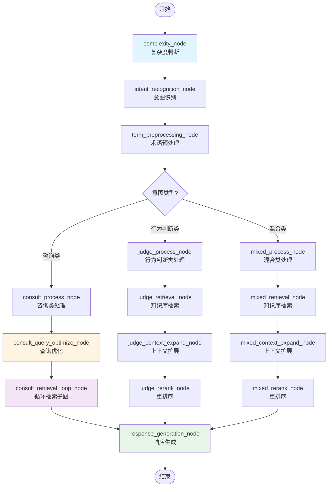
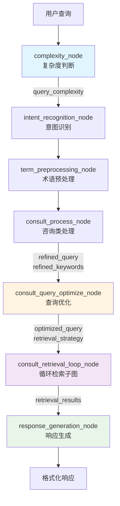
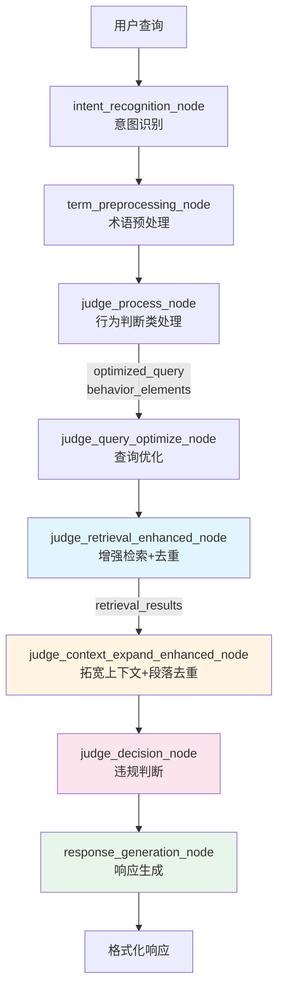
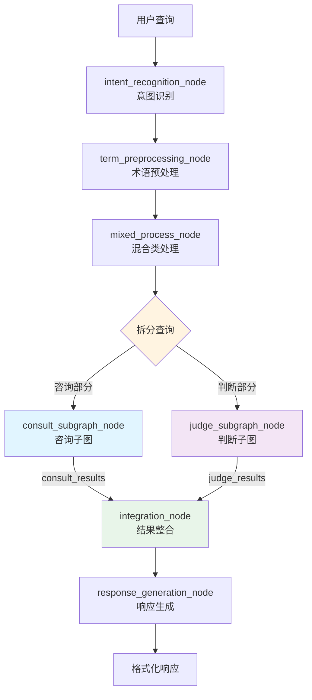
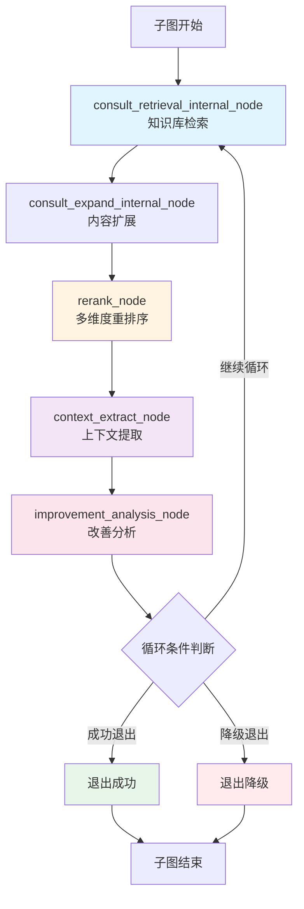

# 工作流详细说明

本文档详细说明学术诚信助手工作流的整体流程和各分支实现细节。

## 目录

- [主图流程](#主图流程)
- [咨询类分支](#咨询类分支)
- [行为判断类分支](#行为判断类分支)
- [混合类分支](#混合类分支)
- [循环检索子图](#循环检索子图)

---

## 主图流程

主图是一个有向无环图（DAG），实现三类意图的分流处理：



### 流程说明

1. **开始阶段**
   - 接收用户查询（`user_query`）
   - 传递到复杂度判断节点

2. **预处理阶段**
   - `complexity_node`：判断查询复杂度（simple/standard/complex）
   - `intent_recognition_node`：识别意图类型（咨询类/行为判断类/混合类）
   - `term_preprocessing_node`：术语标准化和要素提取

3. **分流处理阶段**
   - 根据意图类型，路由到不同的分支
   - 每个分支有独立的处理逻辑

4. **响应生成阶段**
   - 所有分支最终汇聚到响应生成节点
   - 生成自然对话风格的答案

---

## 咨询类分支

咨询类分支是当前最完善的分支，包含复杂度判断、查询优化、循环检索和响应生成：



### 关键节点说明

#### 1. complexity_node（复杂度判断）

**输入**：`user_query`（用户原始查询）

**输出**：`query_complexity`（simple/standard/complex）

**作用**：根据问题的复杂度决定后续检索策略

- **Simple**：单一概念、明确的问题
- **Standard**：中等复杂度，需要综合分析
- **Complex**：多概念关联、需要深入分析

#### 2. consult_query_optimize_node（查询优化）

**输入**：
- `refined_query`：优化后的查询
- `refined_keywords`：提取的关键词
- `query_complexity`：查询复杂度

**输出**：
- `optimized_query`：最终优化的查询
- `retrieval_strategy`：检索策略（包含 top_k, min_score, max_rounds）

**作用**：根据复杂度生成动态检索策略

**检索策略示例**：

```python
# Simple 查询
{
  "top_k": 10,
  "min_score": 0.4,
  "max_rounds": 1
}

# Standard 查询
{
  "top_k": 15,
  "min_score": 0.3,
  "max_rounds": 2
}

# Complex 查询
{
  "top_k": 20,
  "min_score": 0.25,
  "max_rounds": 3
}
```

#### 3. consult_retrieval_loop_node（循环检索子图）

**输入**：
- `user_query`：用户原始查询
- `optimized_query`：优化后的查询
- `retrieval_strategy`：检索策略

**输出**：
- `retrieval_results`：最终检索结果

**作用**：通过循环检索和 LLM 增强获取高质量结果

**详细流程**：见[循环检索子图详解](#循环检索子图)

---

## 行为判断类分支

行为判断类分支用于判断特定行为是否符合学术规范，采用增强检索和去重优化策略：



### 关键节点说明

#### 1. judge_query_optimize_node（查询优化）

**输入**：
- `user_query`：用户原始查询
- `refined_query`：优化后的查询
- `refined_keywords`：提取的关键词

**输出**：
- `optimized_query`：最终优化的查询
- `behavior_subject`：行为主体
- `behavior_action`：行为动作
- `behavior_object`：行为对象
- `optimized_keywords`：优化的关键词

**作用**：提取行为要素，构建增强检索查询

#### 2. judge_retrieval_enhanced_node（增强检索+去重）

**输入**：
- `user_query`：用户原始查询
- `optimized_query`：优化后的查询
- `retrieval_strategy`：检索策略（由查询优化节点设置）

**输出**：
- `retrieval_results`：经过去重和重排序的检索结果（top-12）

**作用**：执行2轮循环检索，通过聚类去重和MMR重排序获取高质量结果

**处理流程**：
```
知识库检索（20条）
  → 贪心聚类（Jaccard, threshold=0.70）
  → 每个聚类保留最高分片段（策略A）
  → MMR重排序（lambda=0.88, top_k=12）
  → 输出最终结果
```

**去重优化策略**：

1. **贪心聚类算法**
   - 使用Jaccard相似度计算片段间相似度（threshold=0.70）
   - 按分数降序排序，贪心分配到现有聚类或创建新聚类
   - 目的：识别并分组高度相似的内容

2. **代表片段选择（策略A）**
   - 每个聚类只保留最高分片段
   - 确保每个代表都是高质量
   - 避免引入低相关性内容

3. **MMR重排序**
   - 平衡相关性和多样性（lambda=0.88，偏重相关性）
   - 从代表片段中选择top-12个结果
   - 确保输出的多样性和质量

**检索策略示例**：

```python
# 行为判断类检索策略
{
  "top_k_first_round": 20,      # 第1轮检索20条
  "min_score_first_round": 0.3, # 第1轮最低分数
  "top_k_second_round": 15,     # 第2轮检索15条
  "min_score_second_round": 0.5 # 第2轮最低分数
}
```

#### 3. judge_context_expand_enhanced_node（拓宽上下文+段落去重）

**输入**：
- `retrieval_results`：经过去重和重排序的检索结果（top-12）

**输出**：
- `full_context_paragraphs`：拓宽后的完整段落（已去重）
- `related_rules`：关联的规则引用
- `decision_basis`：判断依据说明

**作用**：将检索片段扩展为完整段落，并进行段落级别去重

**处理流程**：
```
扩展内容到完整段落（300-500字）
  → 按doc_id分组
  → 每个文档内部进行Jaccard去重（threshold=0.75）
  → 保留最高分段落
  → 输出去重后的完整段落
```

**段落去重策略**：

1. **按doc_id分组**
   - 将所有段落按文档ID分组
   - 保证不同文档之间不跨文档去重
   - 避免单一文档内容过度主导

2. **文档内部去重**
   - 使用Jaccard相似度计算段落间相似度（threshold=0.75）
   - 按分数降序排序，贪心保留高分的非重复段落
   - 确保文档来源多样性

3. **拓宽上下文**
   - 每个片段扩展到300-500字的完整段落
   - 理解规则全貌，提供更完整的判断依据

#### 4. judge_decision_node（违规判断）

**输入**：
- `user_query`：用户原始查询
- `full_context_paragraphs`：拓宽后的完整段落（已去重）
- `related_rules`：关联的规则引用
- `decision_basis`：判断依据说明
- `behavior_subject`：行为主体
- `behavior_action`：行为动作
- `behavior_object`：行为对象

**输出**：
- `can_judge`：是否能够判断
- `is_violation`：是否违规（true/false/null）
- `judgment_basis`：判断依据说明（智能聚合相似规则）
- `relevant_rules`：相关规则引用
- `confidence_score`：置信度分数（0-1）
- `confidence_level`：置信度等级（high/medium/low）
- `needs_clarification`：是否需要澄清
- `clarification_questions`：需要澄清的问题列表
- `missing_information`：缺失的信息列表
- `ambiguity_reasons`：模糊的原因
- `suggested_actions`：建议的行动
- `warning_notes`：警告说明

**作用**：基于拓宽的上下文判断是否违规，评估置信度

**判断特点**：
- 智能聚合相似规则，避免重复表述
- 从不同文档和角度提取判断依据
- 评估判断的置信度，识别需要追问的内容
- 提供结构化的判断结果和证据支持

**置信度等级**：
- **High（≥0.8）**：信息充分，规则明确，判断可靠
- **Medium（0.6-0.8）**：信息较充分，规则较明确，判断较可靠
- **Low（<0.6）**：信息不足或规则模糊，判断不可靠

---

## 混合类分支

混合类分支处理同时包含咨询和行为判断的问题：



### 关键节点说明

#### 1. mixed_process_node（混合类处理）

**输入**：
- `refined_query`：优化后的查询
- `refined_keywords`：提取的关键词

**输出**：
- `consult_query`：咨询部分的查询
- `judge_query`：判断部分的查询
- `shared_context`：共享的上下文信息

**作用**：将混合查询拆分为咨询和判断两个部分

#### 2. consult_subgraph_node（咨询子图）

**输入**：
- `consult_query`：咨询部分的查询
- `shared_context`：共享上下文

**输出**：
- `consult_results`：咨询结果

**作用**：调用咨询类子图，复用咨询类分支的逻辑（2轮循环检索）

#### 3. judge_subgraph_node（判断子图）

**输入**：
- `judge_query`：判断部分的查询
- `behavior_elements`：行为要素
- `shared_context`：共享上下文

**输出**：
- `judge_results`：判断结果

**作用**：调用判断类子图，复用判断类分支的逻辑（增强检索）

#### 4. integration_node（结果整合）

**输入**：
- `consult_results`：咨询结果
- `judge_results`：判断结果
- `shared_context`：共享上下文

**输出**：
- `integrated_results`：整合后的结果

**作用**：将咨询和判断结果整合为统一的答案

---

## 循环检索子图

循环检索子图是咨询类分支的核心，通过多轮检索和 LLM 增强持续提升质量：



### 子图节点说明

#### 1. consult_retrieval_internal_node（知识库检索）

**输入**：
- `user_query`：用户原始查询
- `refined_query`：优化后的查询
- `refined_keywords`：提取的关键词
- `current_round`：当前轮次

**输出**：
- `retrieval_results`：检索结果片段列表

**作用**：根据动态参数（top_k, min_score）执行知识库检索

**检索参数**：
- 第1轮：top_k=15, min_score=0.3
- 第2轮：top_k=10, min_score=0.6
- 第3轮：top_k=8, min_score=0.7

#### 2. consult_expand_internal_node（内容扩展）

**输入**：
- `retrieval_results`：检索结果片段

**输出**：
- `expanded_results`：扩展后的完整段落

**作用**：将检索结果扩展到完整段落（500-800字），提供更完整的上下文

#### 3. rerank_node（多维度重排序）

**输入**：
- `expanded_results`：扩展后的结果
- `user_query`：用户查询

**输出**：
- `ranked_results`：排序后的结果
- `weighted_score`：加权分数
- `top_score`：最高分数
- `top_3_avg`：前3平均分

**作用**：对结果进行多维度评分和排序

**评分维度**：
- **相关性（40%）**：与查询的匹配程度
- **权威性（30%）**：来源的可信度
- **完整性（20%）**：信息的完整性
- **时效性（10%）**：信息的新鲜度

#### 4. context_extract_node（上下文提取）

**输入**：
- `ranked_results`：排序后的结果（top-3）

**输出**：
- `structured_context`：结构化上下文
  - `key_concepts`：关键概念
  - `relation_map`：关系图谱
  - `missing_aspects`：缺失方面
  - `summary`：总结

**作用**：提取关键信息和上下文，为后续改善分析提供依据

#### 5. improvement_analysis_node（改善分析）

**输入**：
- `ranked_results`：排序后的结果
- `structured_context`：结构化上下文
- `history`：历史轮次信息

**输出**：
- `improvement_potential`：改善潜力（高/中/低）
- `recommendation`：优化建议

**作用**：LLM 分析下一轮的改善潜力，指导循环决策

#### 6. 循环条件判断

**判断条件**：
- 综合分数 ≥ target_score（默认 0.8）
- 轮次 ≥ max_rounds（默认 3）
- LLM 预测改善潜力不足
- 检测到收敛或停滞

**输出**：
- `continue`：继续下一轮
- `exit_success`：成功退出（返回高质量结果）
- `exit_fallback`：降级退出（返回当前最佳结果）

**提前退出条件**：
- top_score ≥ 0.85
- top_3_avg ≥ 0.75
- 至少完成1轮检索

---

## 总结

学术诚信助手工作流通过以下设计实现高质量问答：

1. **意图分流**：根据问题类型路由到不同的处理分支
2. **复杂度感知**：根据问题复杂度动态调整检索策略
3. **循环优化**：通过多轮检索和 LLM 增强持续提升质量
4. **多维评估**：采用多维度评分体系确保结果质量
5. **智能退出**：基于分数、轮次和收敛检测智能退出循环

相关文档：
- [配置说明](./configuration.md)
- [开发指南](./development.md)
- [查询示例](./examples.md)
- [技术架构](./architecture.md)
